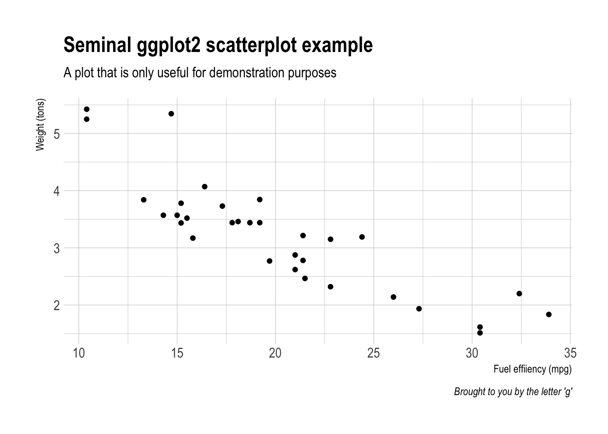
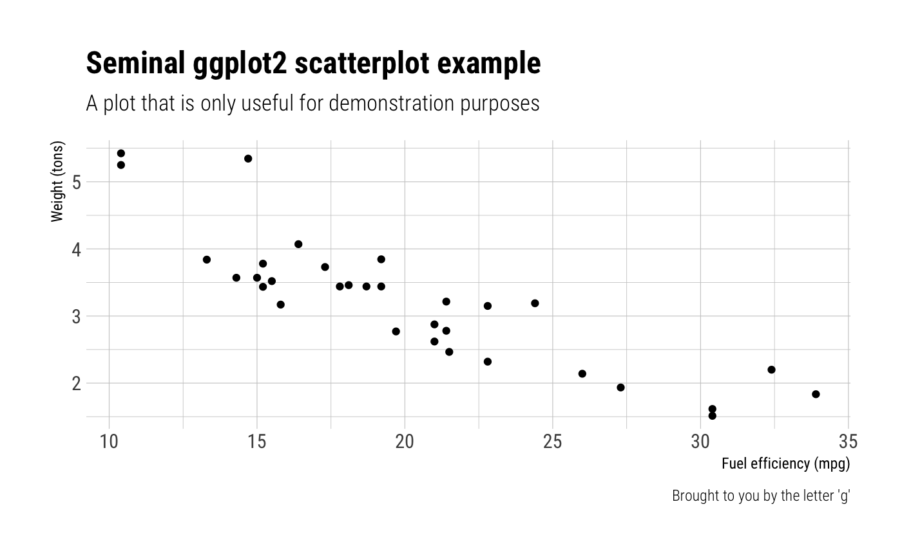
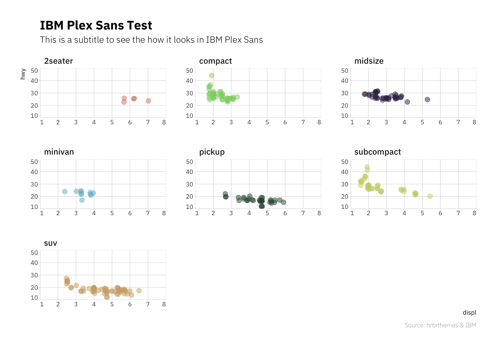
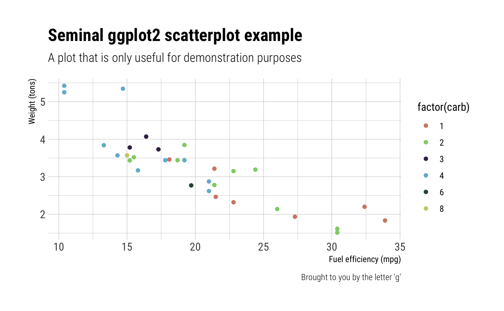
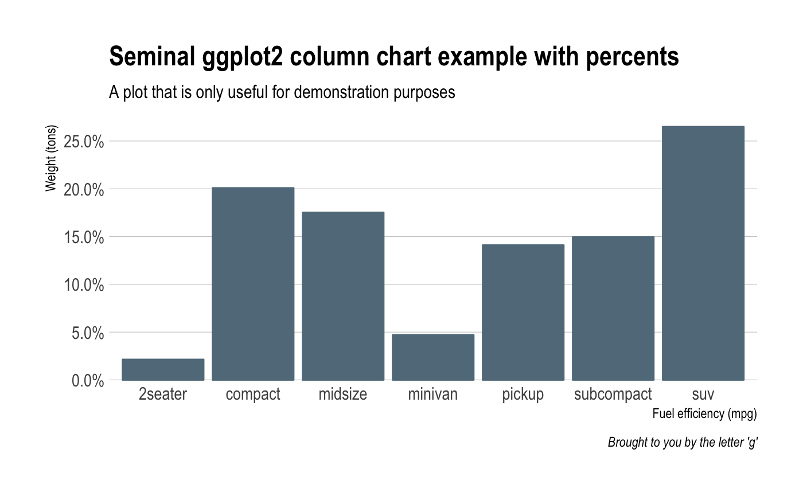
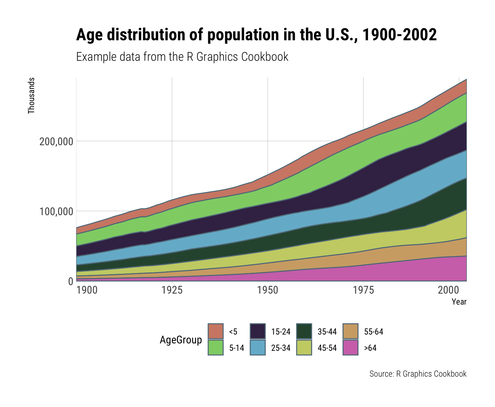

[](http://www.repostatus.org/#active) [](https://travis-ci.org/hrbrmstr/hrbrthemes)

`hrbrthemes` : Additional Themes and Theme Components for 'ggplot2'

This is a very focused package that provides typography-centric themes and theme components for ggplot2. It's a an extract/riff of [`hrbrmisc`](http://github.com/hrbrmstr/hrbrmisc) created by request.

The core theme: `theme_ipsum` ("ipsum" is Latin for "precise") uses Arial Narrow which should be installed on practically any modern system, so it's "free"-ish. This font is condensed, has solid default kerning pairs and geometric numbers. That's what I consider the "font trifecta" must-have for charts. An additional quality for fonts for charts is that they have a diversity of weights. Arial Narrow (the one on most systems, anyway) does not have said diversity but this quality is not (IMO) a "must have".

The following functions are implemented/objects are exported:

-   `theme_ipsum` : Arial Narrow-based theme
-   `theme_ipsum_rc` : Roboto Condensed-based theme
-   `gg_check`: Spell check ggplot2 plot labels
-   `update_geom_font_defaults`: Update matching font defaults for text geoms (the default is — unsurprisingly — Arial Narrow)
-   `scale_x_comma` / `scale_y_comma` : Comma format for axis text and `expand=c(0,0)` (you need to set limits)
-   `scale_x_percent` / `scale_y_percent` : Percent format for axis text and `expand=c(0,0)` (you need to set limits)
-   `scale_color_ipsum` / `scale_fill_ipsum` / `ipsum_pal` : A muted discrete color palette with 9 colors
-   `font_an`: a short global alias for "`Arial Narrow`"
-   `font_rc`: a short global alias for "`Roboto Condensed`"
-   `font_rc_light`: a short global alias for "`Roboto Condensed Light`"

### Installation

``` r
devtools::install_github("hrbrmstr/hrbrthemes")
```

### Usage

``` r
library(hrbrthemes)
library(gcookbook)
library(tidyverse)

# current verison
packageVersion("hrbrthemes")
## [1] '0.1.0'
```

### Base theme (Arial Narrow)

``` r
ggplot(mtcars, aes(mpg, wt)) +
  geom_point() +
  labs(x="Fuel effiiency (mpg)", y="Weight (tons)",
       title="Seminal ggplot2 scatterplot example",
       subtitle="A plot that is only useful for demonstration purposes",
       caption="Brought to you by the letter 'g'") + 
  theme_ipsum()
```



### Roboto Condensed

``` r
ggplot(mtcars, aes(mpg, wt)) +
  geom_point() +
  labs(x="Fuel effiiency (mpg)", y="Weight (tons)",
       title="Seminal ggplot2 scatterplot example",
       subtitle="A plot that is only useful for demonstration purposes",
       caption="Brought to you by the letter 'g'") + 
  theme_ipsum_rc()
```



### Scales (Color/Fill)

``` r
ggplot(mtcars, aes(mpg, wt)) +
  geom_point(aes(color=factor(carb))) +
  labs(x="Fuel effiiency (mpg)", y="Weight (tons)",
       title="Seminal ggplot2 scatterplot example",
       subtitle="A plot that is only useful for demonstration purposes",
       caption="Brought to you by the letter 'g'") + 
  scale_color_ipsum() +
  theme_ipsum_rc()
```



### Scales (Axis)

``` r
count(mpg, class) %>% 
  mutate(pct=n/sum(n)) %>% 
  ggplot(aes(class, pct)) +
  geom_col() +
  scale_y_percent() +
  labs(x="Fuel effiiency (mpg)", y="Weight (tons)",
       title="Seminal ggplot2 column chart example with percents",
       subtitle="A plot that is only useful for demonstration purposes",
       caption="Brought to you by the letter 'g'") + 
  theme_ipsum(grid="Y")
```


``` r
ggplot(uspopage, aes(x=Year, y=Thousands, fill=AgeGroup)) + 
  geom_area() +
  scale_fill_ipsum() +
  scale_x_continuous(expand=c(0,0)) +
  scale_y_comma() +
  labs(title="Age distribution of population in the U.S., 1900-2002",
       subtitle="Example data from the R Graphics Cookbook",
       caption="Source: R Graphics Cookbook") +
  theme_ipsum_rc(grid="XY") +
  theme(axis.text.x=element_text(hjust=c(0, 0.5, 0.5, 0.5, 1))) +
  theme(legend.position="bottom")
```



``` r
update_geom_font_defaults(font_rc_light)

count(mpg, class) %>% 
  mutate(n=n*2000) %>% 
  arrange(n) %>% 
  mutate(class=factor(class, levels=class)) %>% 
  ggplot(aes(class, n)) +
  geom_col() +
  geom_text(aes(label=scales::comma(n)), hjust=0, nudge_y=2000) +
  scale_y_comma(limits=c(0,150000)) +
  coord_flip() +
  labs(x="Fuel effiiency (mpg)", y="Weight (tons)",
       title="Seminal ggplot2 column chart example with commas",
       subtitle="A plot that is only useful for demonstration purposes, esp since you'd never\nreally want direct labels and axis labels",
       caption="Brought to you by the letter 'g'") + 
  theme_ipsum_rc(grid="X")
```



### Spellcheck ggplot2 labels

``` r
df <- data.frame(x=c(20, 25, 30), y=c(4, 4, 4), txt=c("One", "Two", "Three"))

ggplot(mtcars, aes(mpg, wt)) +
  geom_point() +
  labs(x="This is some txt", y="This is more text",
       title="Thisy is a titlle",
       subtitle="This is a subtitley",
       caption="This is a captien") +
  theme_ipsum_rc(grid="XY") -> gg

gg_check(gg)
## Possible misspelled words in [title]: (Thisy, titlle)
## Possible misspelled words in [subtitle]: (subtitley)
## Possible misspelled words in [caption]: (captien)
```



### Test Results

``` r
library(hrbrthemes)
library(testthat)

date()
## [1] "Sun Feb 12 10:14:07 2017"

test_dir("tests/")
## testthat results ========================================================================================================
## OK: 0 SKIPPED: 0 FAILED: 0
## 
## DONE ===================================================================================================================
```

### Code of Conduct

Please note that this project is released with a [Contributor Code of Conduct](CONDUCT.md). By participating in this project you agree to abide by its terms.
