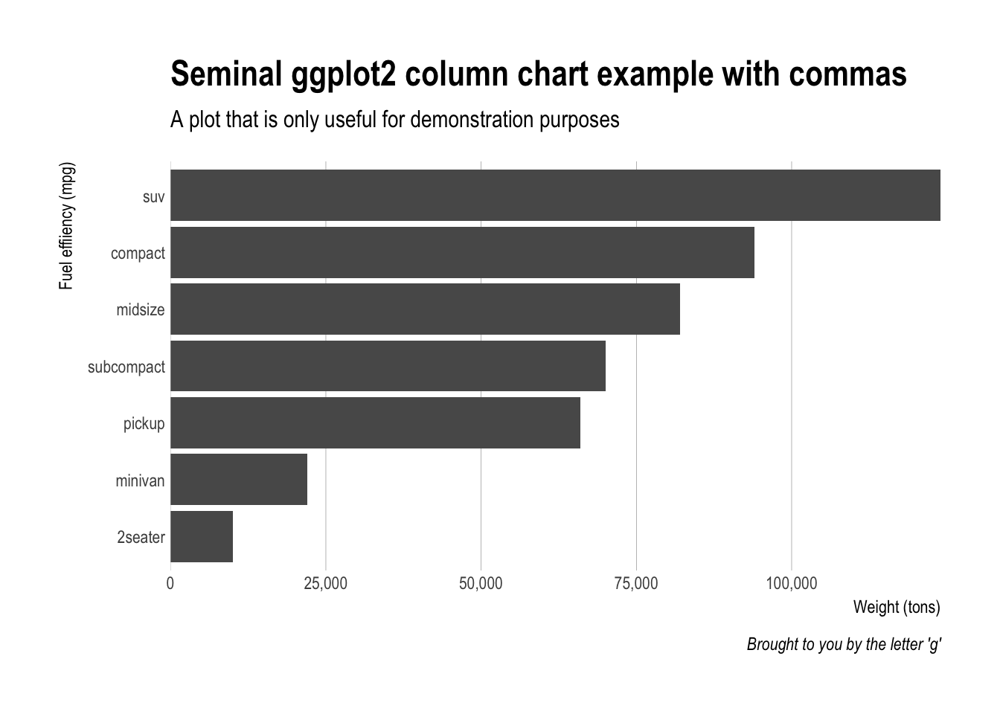

`hrbrthemes` : Additional Themes and Theme Components for 'ggplot2'

This is a very focused package that provides typography-centric themes and theme components for ggplot2. It's a an extract/riff of [`hrbrmisc`](http://github.com/hrbrmstr/hrbrmisc) created by request.

The core theme: `theme_ipsum` ("ipsum" is Latin for "precise") uses Arial Narrow which should be installed on practically any modern system, so it's "free"-ish. This font is condensed, has solid default kerning pairs and geometric numbers. That's what I consider the "font trifecta" must-have for charts. An additional quality for fonts for charts is that they have a diversity of weights. Arial Narrow (the one on most systems, anyway) does not have said diversity but this quality is not (IMO) a "must have".

The following functions are implemented/objects are exported:

-   `theme_ipsum` : Arial Narrow-based theme
-   `update_geom_font_defaults`: Update matching font defaults for text geoms (the default is — unsurprisingly — Arial Narrow)
-   `scale_x_comma` / `scale_y_comma` : Comma format for axis text and `expand=c(0,0)` (you need to set limits)
-   `scale_x_percent` / `scale_y_percent` : Percent format for axis text and `expand=c(0,0)` (you need to set limits)
-   `font_an`: a short global alias for "`Arial Narrow`"

### TODO

-   Creation of supplemental extra font packages with instructions for installation
-   Additional base themes to match ^^
-   At least one new custom color & fill scale
-   Whatever ends up in a feature request in an issue that makes sense ;-)

### Installation

``` r
devtools::install_github("hrbrmstr/hrbrthemes")
```

``` r
options(width=120)
```

### Usage

``` r
library(hrbrthemes)
library(tidyverse)

# current verison
packageVersion("hrbrthemes")
```

    ## [1] '0.1.0'

### Base theme (Arial Narrow)

``` r
ggplot(mtcars, aes(mpg, wt)) +
  geom_point() +
  labs(x="Fuel effiiency (mpg)", y="Weight (tons)",
       title="Seminal ggplot2 scatterplot example",
       subtitle="A plot that is only useful for demonstration purposes",
       caption="Brought to you by the letter 'g'") + 
  theme_ipsum()
```


### Scales

``` r
count(mpg, class) %>% 
  mutate(pct=n/sum(n)) %>% 
  ggplot(aes(class, pct)) +
  geom_col() +
  scale_y_percent() +
  labs(x="Fuel effiiency (mpg)", y="Weight (tons)",
       title="Seminal ggplot2 column chart example with percents",
       subtitle="A plot that is only useful for demonstration purposes",
       caption="Brought to you by the letter 'g'") + 
  theme_ipsum(grid="Y")
```


``` r
count(mpg, class) %>% 
  mutate(n=n*2000) %>% 
  arrange(n) %>% 
  mutate(class=factor(class, levels=class)) %>% 
  ggplot(aes(class, n)) +
  geom_col() +
  scale_y_comma() +
  coord_flip() +
  labs(x="Fuel effiiency (mpg)", y="Weight (tons)",
       title="Seminal ggplot2 column chart example with commas",
       subtitle="A plot that is only useful for demonstration purposes",
       caption="Brought to you by the letter 'g'") + 
  theme_ipsum(grid="X")
```



### Test Results

``` r
library(hrbrthemes)
library(testthat)

date()
```

    ## [1] "Sat Feb 11 12:01:25 2017"

``` r
test_dir("tests/")
```

    ## testthat results ========================================================================================================
    ## OK: 0 SKIPPED: 0 FAILED: 0
    ## 
    ## DONE ===================================================================================================================

### Code of Conduct

Please note that this project is released with a [Contributor Code of Conduct](CONDUCT.md). By participating in this project you agree to abide by its terms.
