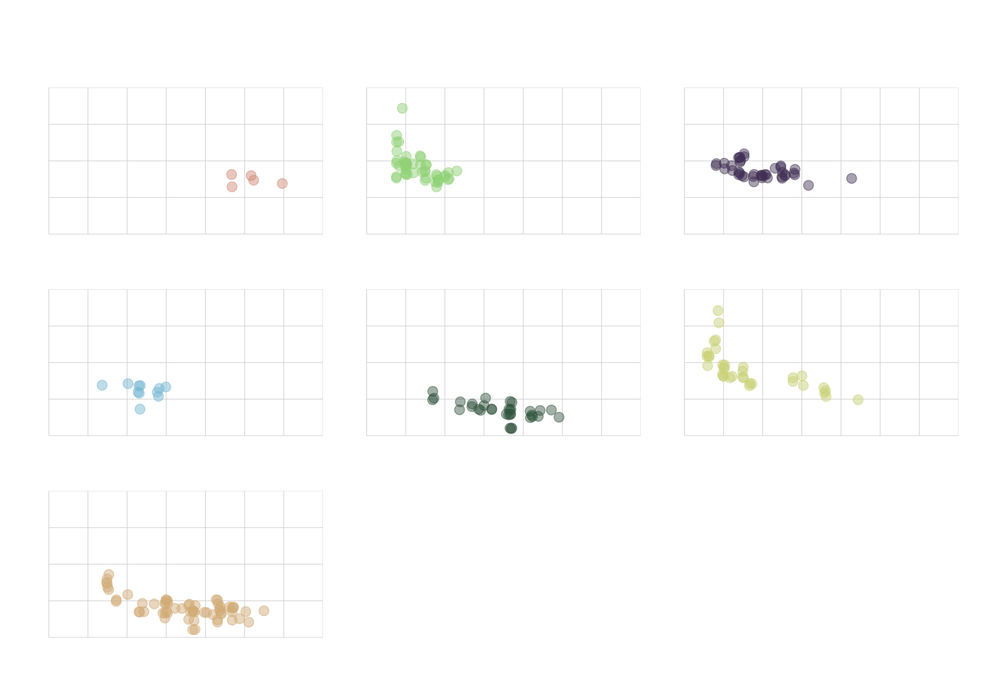

[](https://www.repostatus.org/#active)
[](https://keybase.io/hrbrmstr)

[](https://travis-ci.org/hrbrmstr/hrbrthemes)
[](https://codecov.io/gh/hrbrmstr/hrbrthemes)
[](https://cranchecks.info/pkgs/hrbrthemes)
[](https://www.r-pkg.org/pkg/hrbrthemes)


[](https://doi.org/10.5281/zenodo.2545422)

## hrbrthemes

Additional Themes and Theme Components for ‘ggplot2’

-----

This is a very focused package that provides typography-centric themes
and theme components for ggplot2. It’s a an extract/riff of
[`hrbrmisc`](https://github.com/hrbrmstr/hrbrmisc) created by request.

The core theme: `theme_ipsum` (“ipsum” is Latin for “precise”) uses
Arial Narrow which should be installed on practically any modern system,
so it’s “free”-ish. This font is condensed, has solid default kerning
pairs and geometric numbers. That’s what I consider the “font trifecta”
must-have for charts. An additional quality for fonts for charts is that
they have a diversity of weights. Arial Narrow (the one on most systems,
anyway) does not have said diversity but this quality is not (IMO) a
“must have”.

The following functions are implemented/objects are exported:

Themes:

  - `theme_ipsum`: Arial Narrow
  - `theme_ipsum_es`: Ccon Sans Condensed
  - `theme_ipsum_rc`: Roboto Condensed
  - `theme_ipsum_ps`: IBM Plex Sans font
  - `theme_ipsum_pub`: Public Sans
  - `theme_ipsum_tw`: Titilium Web
  - `theme_modern_rc`: Roboto Condensed dark theme
  - `theme_ft_rc`: Dark theme based on FT’s dark theme (Roboto
    Condensed)

Scales (that align with various themes):

  - `scale_color_ipsum`: Discrete color & fill scales based on the ipsum
    palette
  - `scale_colour_ipsum`: Discrete color & fill scales based on the
    ipsum palette
  - `scale_fill_ipsum`: Discrete color & fill scales based on the ipsum
    palette
  - `scale_color_ft`: Discrete color & fill scales based on the FT
    palette
  - `scale_colour_ft`: Discrete color & fill scales based on the FT
    palette
  - `scale_fill_ft`: Discrete color & fill scales based on the FT
    palette
  - `scale_x_comma`: X & Y scales with opinionated presets for percent &
    comma label formats
  - `scale_x_percent`: X & Y scales with opinionated presets for percent
    & comma label formats
  - `scale_y_comma`: X & Y scales with opinionated presets for percent &
    comma label formats
  - `scale_y_percent`: X & Y scales with opinionated presets for percent
    & comma label formats

Palettes/Named Colors:

  - `ipsum_pal`: A muted, qualitative color palette
  - `ft_cols`: FT color palette
  - `ft_pal`: A bright qualitative color palette
  - `ft_text_col`: FT color palette

Fonts:

  - `font_an`: Arial Narrow font name R variable aliases
  - `font_es`: Econ Sans font name R variable aliases
  - `font_es_bold`: Econ Sans font name R variable aliases
  - `font_es_light`: Econ Sans font name R variable aliases
  - `font_rc`: Roboto Condensed font name R variable aliases
  - `font_rc_light`: Roboto Condensed font name R variable aliases
  - `font_pub`: Public Sans font name R variable aliases
  - `font_pub_bold`: Public Sans font name R variable aliases
  - `font_pub_light`: Public Sans font name R variable aliases
  - `font_pub_thin`: Public Sans font name R variable aliases
  - `font_ps`: PlexSans font name R variable aliases
  - `font_ps_light`: PlexSans font name R variable aliases
  - `font_tw`: Titillium Web font name R variable aliases
  - `font_tw_bold`: Titillium Web font name R variable aliases
  - `font_tw_light`: Titillium Web font name R variable aliases

R Markdown:

  - `ipsum`: ipsum R markdown template
  - `ipsum_pdf`: ipsum R markdown template for PDF output

Utilities:

  - `flush_ticks`: Makes axis text labels flush on the ends
  - `ft_geom_defaults`: Change geom defaults from black to custom lights
    for the FT theme
  - `gg_check`: Spell check ggplot2 plot labels
  - `import_econ_sans`: Import Econ Sans Condensed font for use in
    charts
  - `import_plex_sans`: Import IBM Plex Sans font for use in charts
  - `import_roboto_condensed`: Import Roboto Condensed font for use in
    charts
  - `import_titillium_web`: Import Titillium Web font for use in charts
  - `modern_geom_defaults`: Change geom defaults from black to white for
    the modern theme
  - `update_geom_font_defaults`: Update matching font defaults for text
    geoms

### Installation

``` r
install.packages("hrbrthemes", repos = "https://cinc.rud.is")
# or
remotes::install_git("https://git.rud.is/hrbrmstr/hrbrthemes.git")
# or
remotes::install_git("https://git.sr.ht/~hrbrmstr/hrbrthemes")
# or
remotes::install_gitlab("hrbrmstr/hrbrthemes")
# or
remotes::install_bitbucket("hrbrmstr/hrbrthemes")
# or
remotes::install_github("hrbrmstr/hrbrthemes")
```

NOTE: To use the ‘remotes’ install options you will need to have the
[{remotes} package](https://github.com/r-lib/remotes) installed.

### Usage

``` r
library(hrbrthemes)
library(gcookbook)
library(tidyverse)

# current verison
packageVersion("hrbrthemes")
## [1] '0.7.1'
```

### Base theme (Arial Narrow)

``` r
ggplot(mtcars, aes(mpg, wt)) +
  geom_point() +
  labs(x="Fuel efficiency (mpg)", y="Weight (tons)",
       title="Seminal ggplot2 scatterplot example",
       subtitle="A plot that is only useful for demonstration purposes",
       caption="Brought to you by the letter 'g'") + 
  theme_ipsum()
```


### Roboto Condensed

``` r
ggplot(mtcars, aes(mpg, wt)) +
  geom_point() +
  labs(x="Fuel efficiency (mpg)", y="Weight (tons)",
       title="Seminal ggplot2 scatterplot example",
       subtitle="A plot that is only useful for demonstration purposes",
       caption="Brought to you by the letter 'g'") + 
  theme_ipsum_rc()
```


### New FT Theme\!

``` r
ggplot(mtcars, aes(mpg, wt)) +
  geom_point(color = ft_cols$yellow) +
  labs(x="Fuel efficiency (mpg)", y="Weight (tons)",
       title="Seminal ggplot2 scatterplot example",
       subtitle="A plot that is only useful for demonstration purposes",
       caption="Brought to you by the letter 'g'") + 
  theme_ft_rc()
```


### IBM Plex Sans

``` r
ggplot(mpg, aes(displ, hwy)) +
  geom_jitter(aes(color=class, fill=class), size=3, shape=21, alpha=1/2) +
  scale_x_continuous(expand=c(0,0), limits=c(1, 8), breaks=1:8) +
  scale_y_continuous(expand=c(0,0), limits=c(10, 50)) +
  scale_color_ipsum() +
  scale_fill_ipsum() +
  facet_wrap(~class, scales="free") +
  labs(
    title="IBM Plex Sans Test",
    subtitle="This is a subtitle to see the how it looks in IBM Plex Sans",
    caption="Source: hrbrthemes & IBM"
  ) +
  theme_ipsum_ps(grid="XY", axis="xy") +
  theme(legend.position="none") -> gg

flush_ticks(gg)
## theme(axis.text.x=element_text(hjust=c(0, rep(0.5, 6), 1))) +
## theme(axis.text.y=element_text(vjust=c(0, rep(0.5, 3), 1)))
```


### Titillium Web

``` r
ggplot(mpg, aes(displ, hwy)) +
  geom_jitter(aes(color=class, fill=class), size=3, shape=21, alpha=1/2) +
  scale_x_continuous(expand=c(0,0), limits=c(1, 8), breaks=1:8) +
  scale_y_continuous(expand=c(0,0), limits=c(10, 50)) +
  scale_color_ipsum() +
  scale_fill_ipsum() +
  facet_wrap(~class, scales="free") +
  labs(
    title="Titillium Web",
    subtitle="This is a subtitle to see the how it looks in Titillium Web",
    caption="Source: hrbrthemes & Google"
  ) +
  theme_ipsum_tw(grid="XY", axis="xy") +
  theme(legend.position="none") -> gg

flush_ticks(gg)
## theme(axis.text.x=element_text(hjust=c(0, rep(0.5, 6), 1))) +
## theme(axis.text.y=element_text(vjust=c(0, rep(0.5, 3), 1)))
```



### Scales (Color/Fill)

``` r
ggplot(mtcars, aes(mpg, wt)) +
  geom_point(aes(color=factor(carb))) +
  labs(x="Fuel efficiency (mpg)", y="Weight (tons)",
       title="Seminal ggplot2 scatterplot example",
       subtitle="A plot that is only useful for demonstration purposes",
       caption="Brought to you by the letter 'g'") + 
  scale_color_ipsum() +
  theme_ipsum_rc()
```


### Scales (Axis)

``` r
count(mpg, class) %>% 
  mutate(pct=n/sum(n)) %>% 
  ggplot(aes(class, pct)) +
  geom_col() +
  scale_y_percent() +
  labs(x="Fuel efficiency (mpg)", y="Weight (tons)",
       title="Seminal ggplot2 column chart example with percents",
       subtitle="A plot that is only useful for demonstration purposes",
       caption="Brought to you by the letter 'g'") + 
  theme_ipsum(grid="Y")
```


``` r
ggplot(uspopage, aes(x=Year, y=Thousands, fill=AgeGroup)) + 
  geom_area() +
  scale_fill_ipsum() +
  scale_x_continuous(expand=c(0,0)) +
  scale_y_comma() +
  labs(title="Age distribution of population in the U.S., 1900-2002",
       subtitle="Example data from the R Graphics Cookbook",
       caption="Source: R Graphics Cookbook") +
  theme_ipsum_rc(grid="XY") +
  theme(axis.text.x=element_text(hjust=c(0, 0.5, 0.5, 0.5, 1))) +
  theme(legend.position="bottom")
```


``` r
update_geom_font_defaults(font_rc_light)

count(mpg, class) %>% 
  mutate(n=n*2000) %>% 
  arrange(n) %>% 
  mutate(class=factor(class, levels=class)) %>% 
  ggplot(aes(class, n)) +
  geom_col() +
  geom_text(aes(label=scales::comma(n)), hjust=0, nudge_y=2000) +
  scale_y_comma(limits=c(0,150000)) +
  coord_flip() +
  labs(x="Fuel efficiency (mpg)", y="Weight (tons)",
       title="Seminal ggplot2 column chart example with commas",
       subtitle="A plot that is only useful for demonstration purposes, esp since you'd never\nreally want direct labels and axis labels",
       caption="Brought to you by the letter 'g'") + 
  theme_ipsum_rc(grid="X")
```


### Spellcheck ggplot2 labels

``` r
df <- data.frame(x=c(20, 25, 30), y=c(4, 4, 4), txt=c("One", "Two", "Three"))

ggplot(mtcars, aes(mpg, wt)) +
  geom_point() +
  labs(x="This is some txt", y="This is more text",
       title="Thisy is a titlle",
       subtitle="This is a subtitley",
       caption="This is a captien") +
  theme_ipsum_rc(grid="XY") -> gg

gg_check(gg)
## Possible misspelled words in [title]: (Thisy, titlle)
## Possible misspelled words in [subtitle]: (subtitley)
## Possible misspelled words in [caption]: (captien)
```


### hrbrthemes Metrics

| Lang | \# Files |  (%) |  LoC |  (%) | Blank lines |  (%) | \# Lines |  (%) |
| :--- | -------: | ---: | ---: | ---: | ----------: | ---: | -------: | ---: |
| R    |       22 | 0.92 | 1340 | 0.91 |         259 | 0.73 |      775 | 0.82 |
| Rmd  |        2 | 0.08 |  129 | 0.09 |          98 | 0.27 |      167 | 0.18 |

### Code of Conduct

Please note that this project is released with a Contributor Code of
Conduct. By participating in this project you agree to abide by its
terms.
